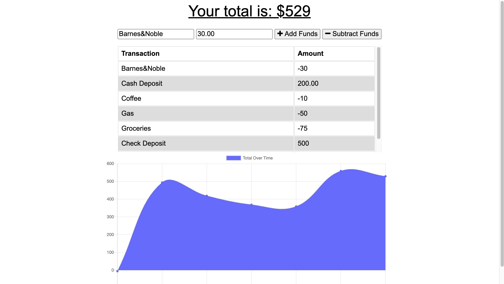

  # Loreina Salalila - Progressive Budget
  
  ## Description
  In this repository, a user will be able to add expenses and deposits to their budget with or without a connection. When entering transactions offline, they are able populate the total when brought back online. [Check out the deployed project over on Heroku](https://hw-progressive-budget.herokuapp.com/).
  ## Table of Contents
  * [Usage](#usage)
  * [License](#license)
  * [Contact](#contact)
  * [Screenshots](#screenshots)
  ## Installation
  Check package.json for dependenscies and in the terminal install node modules.
  - Once modules installed, run server.js
  - Make sure that app is listening and then open chrome browser to localhost:3000
  ```npm install```
  ```npm init``` is used to install dependencies.
  ```node server.js```
  ## Usage
  Node.js must be installed onto your system prior to usage. Repo MUST include package.json with required dependencies.
  ## License
  
  (https://opensource.org/licenses/MIT)
  ## Contact
  Have a question? Email me directly at vialoraine.gg@gmail.com.
  Check out my other projects at [Vialoraine](https://github.com/Vialoraine).
  ## Screenshots
  
